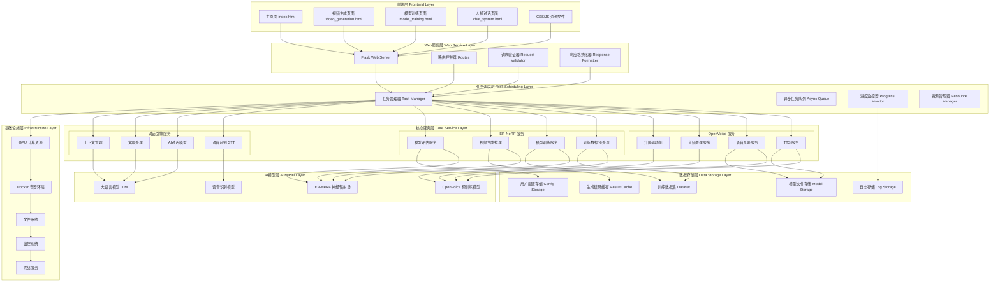
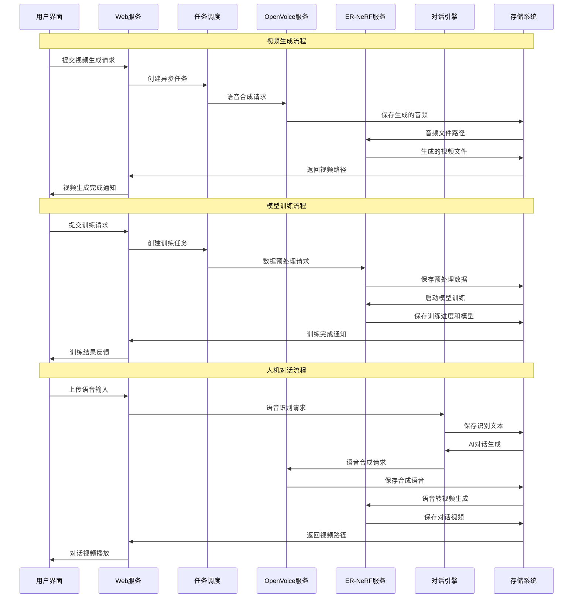

# TFG_ui 系统架构设计

## 系统总体架构图

```mermaid
graph TB
    subgraph "前端层 Frontend Layer"
        A1[主页面 index.html]
        A2[视频生成页面 video_generation.html]
        A3[模型训练页面 model_training.html]
        A4[人机对话页面 chat_system.html]
        A5[CSS/JS 资源文件]
    end

    subgraph "Web服务层 Web Service Layer"
        B1[Flask Web Server]
        B2[路由控制器 Routes]
        B3[请求验证器 Request Validator]
        B4[响应格式化器 Response Formatter]
    end

    subgraph "任务调度层 Task Scheduling Layer"
        C1[任务管理器 Task Manager]
        C2[异步任务队列 Async Queue]
        C3[进度监控器 Progress Monitor]
        C4[资源管理器 Resource Manager]
    end

    subgraph "核心服务层 Core Service Layer"
        subgraph "OpenVoice 服务"
            D1[TTS 服务]
            D2[语音克隆服务]
            D3[音频处理服务]
            D4[升降调功能]
        end

        subgraph "ER-NeRF 服务"
            D5[训练数据预处理]
            D6[模型训练服务]
            D7[视频生成推理]
            D8[模型评估服务]
        end

        subgraph "对话引擎服务"
            D9[语音识别 STT]
            D10[AI对话模型]
            D11[文本处理]
            D12[上下文管理]
        end
    end

    subgraph "AI模型层 AI Model Layer"
        E1[OpenVoice 预训练模型]
        E2[ER-NeRF 神经辐射场]
        E3[大语言模型 LLM]
        E4[语音识别模型]
    end

    subgraph "数据存储层 Data Storage Layer"
        F1[模型文件存储 Model Storage]
        F2[训练数据集 Dataset]
        F3[生成结果缓存 Result Cache]
        F4[用户配置存储 Config Storage]
        F5[日志存储 Log Storage]
    end

    subgraph "基础设施层 Infrastructure Layer"
        G1[GPU 计算资源]
        G2[Docker 容器环境]
        G3[文件系统]
        G4[监控系统]
        G5[网络服务]
    end

    %% 连接关系
    A1 --> B1
    A2 --> B1
    A3 --> B1
    A4 --> B1
    A5 --> B1

    B1 --> C1
    B2 --> C1
    B3 --> C1
    B4 --> C1

    C1 --> D1
    C1 --> D2
    C1 --> D3
    C1 --> D4
    C1 --> D5
    C1 --> D6
    C1 --> D7
    C1 --> D8
    C1 --> D9
    C1 --> D10
    C1 --> D11
    C1 --> D12

    D1 --> E1
    D2 --> E1
    D3 --> E1
    D4 --> E1
    D5 --> E2
    D6 --> E2
    D7 --> E2
    D8 --> E2
    D9 --> E4
    D10 --> E3
    D11 --> E3
    D12 --> E3

    D1 --> F1
    D2 --> F1
    D5 --> F2
    D6 --> F2
    D7 --> F3
    D8 --> F4
    C3 --> F5

    C1 --> G1
    G1 --> G2
    G2 --> G3
    G3 --> G4
    G4 --> G5
```

## 核心数据流图

```mermaid
sequenceDiagram
    participant U as 用户界面
    participant W as Web服务
    participant T as 任务调度
    participant OV as OpenVoice服务
    participant EN as ER-NeRF服务
    participant AI as 对话引擎
    participant S as 存储系统

    Note over U,S: 视频生成流程
    U->>W: 提交视频生成请求
    W->>T: 创建异步任务
    T->>OV: 语音合成请求
    OV->>S: 保存生成的音频
    S->>EN: 音频文件路径
    EN->>S: 生成的视频文件
    S->>W: 返回视频路径
    W->>U: 视频生成完成通知

    Note over U,S: 模型训练流程
    U->>W: 提交训练请求
    W->>T: 创建训练任务
    T->>EN: 数据预处理请求
    EN->>S: 保存预处理数据
    S->>EN: 启动模型训练
    EN->>S: 保存训练进度和模型
    S->>W: 训练完成通知
    W->>U: 训练结果反馈

    Note over U,S: 人机对话流程
    U->>W: 上传语音输入
    W->>AI: 语音识别请求
    AI->>S: 保存识别文本
    S->>AI: AI对话生成
    AI->>OV: 语音合成请求
    OV->>S: 保存合成语音
    S->>EN: 语音转视频生成
    EN->>S: 保存对话视频
    S->>W: 返回视频路径
    W->>U: 对话视频播放
```
