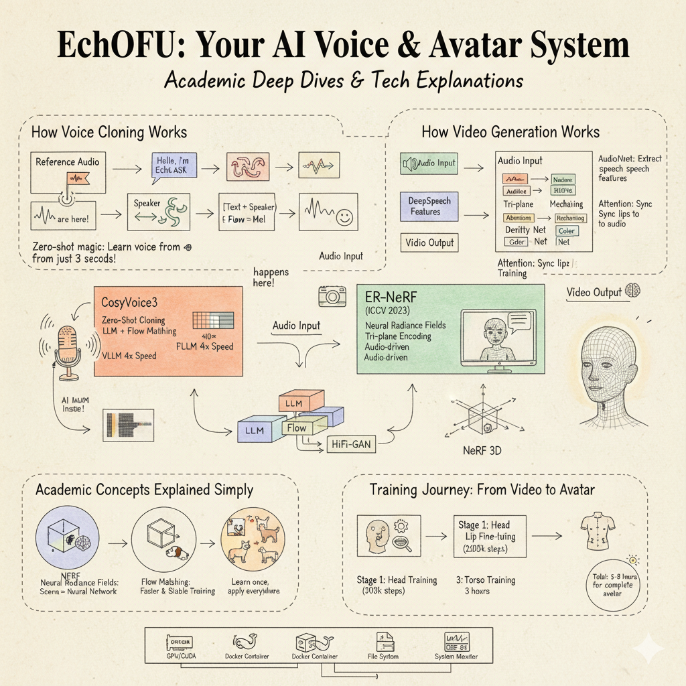
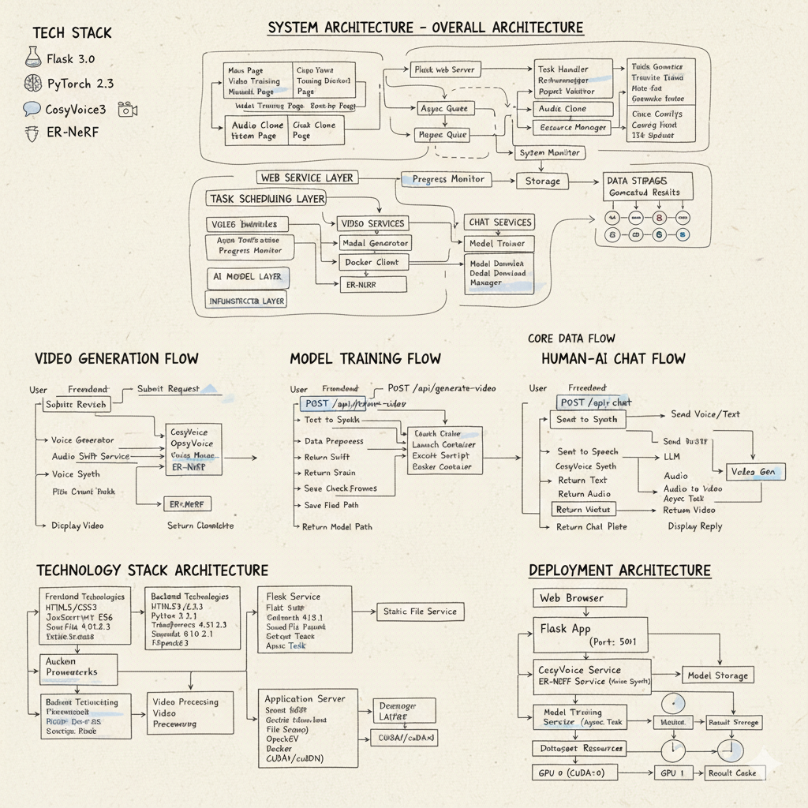

# EchOfU: Multimodal AI Voice Interaction and Virtual Human Generation System

**EchOfU** is a comprehensive intelligent voice dialogue system integrating advanced AI technologies including zero-shot voice cloning, audio-driven video synthesis, and human-computer interaction.

## Overview

EchOfU combines state-of-the-art models in speech synthesis and neural radiance fields to create a complete pipeline for virtual avatar generation:

- **CosyVoice3** ([FunAudioLLM](https://github.com/FunAudioLLM/CosyVoice)): Zero-shot voice cloning with multi-language support
- **ER-NeRF** ([ICCV 2023](https://arxiv.org/abs/2305.07078)): Audio-driven talking head synthesis using Efficient Region-Aware Neural Radiance Fields
- **SyncTalk**: Alternative video generation pipeline with real-time inference

## Quick Start

📖 **[Get started with our Quick Start Guide →](EchOfU/docs/快速开始.md)**

Complete guide including installation, configuration, and troubleshooting.

---

## System Architecture



The system adopts a layered architecture:
- **Presentation Layer**: Flask-based web interface with modular frontend components
- **Business Logic Layer**: Voice generation, video synthesis, model training, chat engine
- **AI Model Layer**: CosyVoice3, ER-NeRF, SyncTalk, GLM-4 LLM integration
- **Infrastructure Layer**: Docker containerization, GPU acceleration, audio processing

---

## Key Features

### 1. Zero-Shot Voice Cloning
- **Model**: Fun-CosyVoice3-0.5B-2512
- **Capability**: Clone arbitrary voice from 3-5 seconds of reference audio
- **Languages**: 9 languages (Chinese, English, Japanese, Korean, etc.)
- **Optimization**: VLLM acceleration for 4x inference speedup

### 2. Neural Video Generation
- **ER-NeRF**: High-fidelity audio-driven video synthesis with tri-plane encoding and audio attention mechanism
- **Training Pipeline**: Three-stage training (Head → Lips → Torso, ~5-8 hours on RTX 4090)
- **Inference**: DeepSpeech feature extraction → NeRF rendering with ray marching

### 3. Model Training
- Automated training workflow with Docker containerization
- Support for both ER-NeRF and SyncTalk models
- Comprehensive evaluation metrics (PSNR, LPIPS, LMD)

### 4. Conversational AI
- Full dialogue pipeline: ASR → LLM → TTS → Video Generation
- Integration with Zhipu AI GLM-4-Plus
- Real-time audio response and avatar synchronization

---

## Technical Specifications

### CosyVoice3 Architecture
```
Text Input → Frontend → LLM (Qwen-based) → Flow Matching (DiT) → HiFi-GAN → Audio Output
                                    ↓
                              Speaker Embedding
                              (from Reference Audio)
```

### ER-NeRF Pipeline
```
Audio → DeepSpeech Features → AudioNet → NeRF Network → Ray Marching → Video Output
                                              ↓
                                [XY, YZ, XZ] Tri-plane Encoding
                                              ↓
                                Density & Color Networks
```

---

## Documentation

- **[Quick Start Guide](EchOfU/docs/快速开始.md)** - Installation, configuration, and troubleshooting
- **[Complete Configuration](EchOfU/docs/配置文档.md)** - CosyVoice and ER-NeRF detailed setup
- **[ER-NeRF Deployment](EchOfU/docs/docker/ERNERF_DEPLOYMENT.md)** - Docker deployment steps
- **[Docker Usage](EchOfU/docs/docker/ERNERF_DOCKER.md)** - Docker command reference

---

## Citation

If you find this project useful, please consider citing:

```bibtex
@software{echOfU2025,
  title={EchOfU: Multimodal AI Voice Interaction System},
  author={Li, Muyuan and Long, Shangkun and Li, Yijie and Zhao, Xialu and Li, Kexin and Wang, Yifan and Pei, Tao},
  year={2025},
  month={December},
  url={https://github.com/3uyuan1ee/TFG_ui}
}
```

## License

This project is licensed under the Apache License 2.0 - see the LICENSE file for details.

## Acknowledgments

- [CosyVoice](https://github.com/FunAudioLLM/CosyVoice) by FunAudioLLM, Alibaba Group
- [ER-NeRF](https://github.com/Fictionarry/ER-NeRF) - ICCV 2023
- [SyncTalk](https://github.com/Fictionarry/SyncTalk)
- [Matcha-TTS](https://github.com/shashankTY/Matcha-TTS)